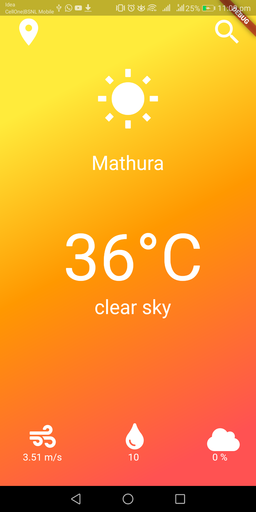
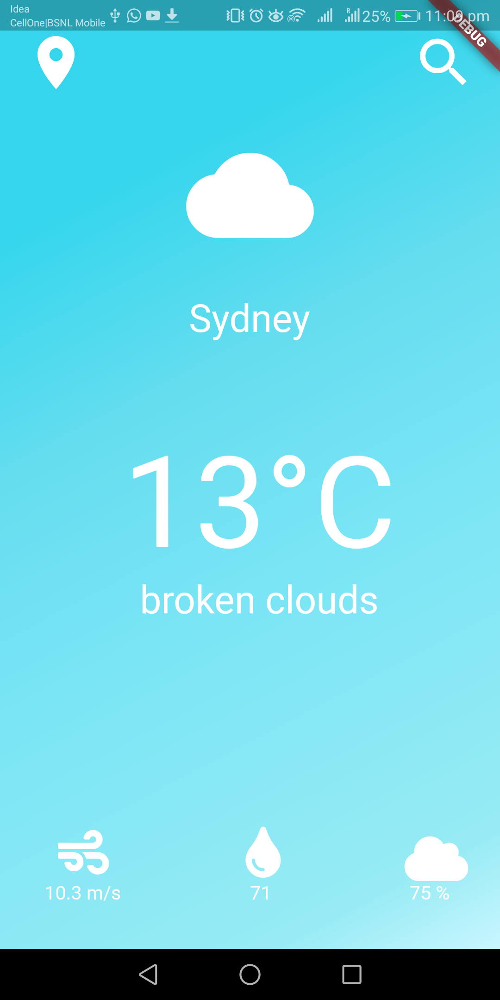
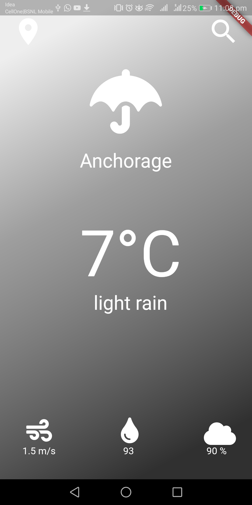

# Clima ☁

This is aweather app which gives live weather data of current location of the device as well as the weather for any city.
In this app asynchronous programming in Dart is used. Time consuming tasks such as getting device location and networking to get data from the internet is done in this app. 

